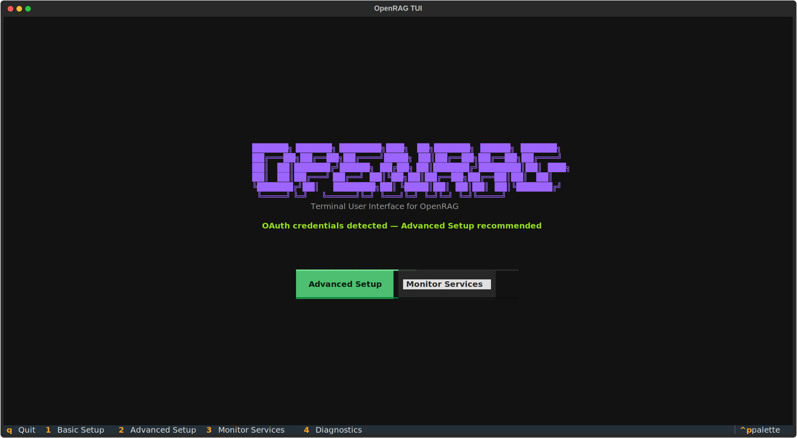

# OpenRAG

[](https://deepwiki.com/phact/openrag)

OpenRAG is a comprehensive Retrieval-Augmented Generation platform that enables intelligent document search and AI-powered conversations. Users can upload, process, and query documents through a chat interface backed by large language models and semantic search capabilities. The system utilizes Langflow for document ingestion, retrieval workflows, and intelligent nudges, providing a seamless RAG experience. Built with Starlette, Next.js, OpenSearch, and Langflow integration.
<div align="center">
  <a href="#quick-start" style="color: #0366d6;">🚀 Quick Start</a> &nbsp;&nbsp;|&nbsp;&nbsp;
  <a href="#tui-interface" style="color: #0366d6;">💻 TUI Interface</a> &nbsp;&nbsp;|&nbsp;&nbsp;
  <a href="#docker-deployment" style="color: #0366d6;">🐳 Docker Deployment</a> &nbsp;&nbsp;|&nbsp;&nbsp;
  <a href="#development" style="color: #0366d6;">⚙️ Development</a> &nbsp;&nbsp;|&nbsp;&nbsp;
  <a href="#troubleshooting" style="color: #0366d6;">🔧 Troubleshooting</a>
</div>

## 🚀 Quick Start

### Prerequisites

- Docker or Podman with Compose installed
- Make (for development commands)

### 1. Environment Setup

```bash
# Clone and setup environment
git clone https://github.com/langflow-ai/openrag.git
cd openrag
make setup  # Creates .env and installs dependencies
```

### 2. Configure Environment

Edit `.env` with your API keys and credentials:

```bash
# Required
OPENAI_API_KEY=your_openai_api_key
OPENSEARCH_PASSWORD=your_secure_password
LANGFLOW_SUPERUSER=admin
LANGFLOW_SUPERUSER_PASSWORD=your_secure_password
LANGFLOW_CHAT_FLOW_ID=your_chat_flow_id
LANGFLOW_INGEST_FLOW_ID=your_ingest_flow_id
NUDGES_FLOW_ID=your_nudges_flow_id
```
ee extended configuration, including ingestion and optional variables: [docs/configuration.md](docs/
configuration.md)
### 3. Start OpenRAG

```bash
# Full stack with GPU support
make dev

# Or CPU only
make dev-cpu
```

Access the services:
- **Frontend**: http://localhost:3000
- **Backend API**: http://localhost:8000
- **Langflow**: http://localhost:7860
- **OpenSearch**: http://localhost:9200
- **OpenSearch Dashboards**: http://localhost:5601

## 🖥️ TUI Interface

OpenRAG includes a powerful Terminal User Interface (TUI) for easy setup, configuration, and monitoring. The TUI provides a user-friendly way to manage your OpenRAG installation without complex command-line operations.



### Launching the TUI

```bash
# Install dependencies first
uv sync

# Launch the TUI
uv run openrag
```

### TUI Features

See the full TUI guide for features, navigation, and benefits: [docs/tui.md](docs/tui.md)


## 🐳 Docker Deployment

### Standard Deployment

```bash
# Build and start all services
docker compose build
docker compose up -d
```

### CPU-Only Deployment

For environments without GPU support:

```bash
docker compose -f docker-compose-cpu.yml up -d
```

More deployment commands and tips: [docs/docker.md](docs/docker.md)

## 🔧 Troubleshooting

### Podman on macOS

If using Podman on macOS, you may need to increase VM memory:

```bash
podman machine stop
podman machine rm
podman machine init --memory 8192   # 8 GB example
podman machine start
```

### Common Issues

See common issues and fixes: [docs/troubleshooting.md](docs/troubleshooting.md)


## 🛠️ Development

For developers wanting to contribute to OpenRAG or set up a development environment, please see our comprehensive development guide:

**[📚 See CONTRIBUTING.md for detailed development instructions](CONTRIBUTING.md)**

The contributing guide includes:
- Complete development environment setup
- Local development workflows  
- Testing and debugging procedures
- Code style guidelines
- Architecture overview
- Pull request guidelines

### Quick Development Commands

```bash
make help                    # See all available commands
make setup                   # Initial development setup
make infra                   # Start infrastructure services
make backend                 # Run backend locally
make frontend                # Run frontend locally
```