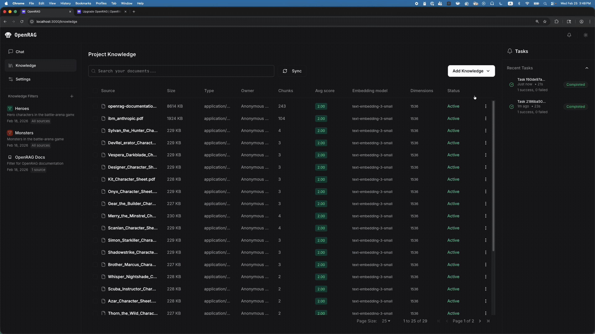
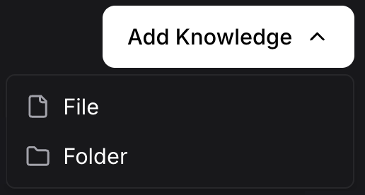

<div align="center">


# BomaRAG

<h3>
  <em>Intelligent Agent-powered document search</em>
</h3>

<!-- Badges -->

[](https://github.com/langflow-ai/langflow)
[](https://github.com/opensearch-project/OpenSearch)
[](https://github.com/docling-project/docling)

[](https://docs.bomarag.com)
[](./LICENSE)

<sub>A <strong>Bomalogic Automation</strong> product.</sub>

</div>

---

**BomaRAG** is Bomalogic Automation's Retrieval-Augmented Generation platform: intelligent document search and AI-powered conversations over your own knowledge base, deployable as a private stack or a hosted multi-tenant service.

Users can upload, process, and query documents through a chat interface backed by large language models and semantic search capabilities. The system utilizes Langflow for document ingestion, retrieval workflows, and intelligent nudges, providing a seamless RAG experience.

Check out the [documentation](https://docs.bomarag.com/) or get started with the [quickstart](https://docs.bomarag.com/quickstart).

Built with [FastAPI](https://fastapi.tiangolo.com/) and [Next.js](https://github.com/vercel/next.js). 
Powered by [OpenSearch](https://github.com/opensearch-project/OpenSearch), [Langflow](https://github.com/langflow-ai/langflow), and [Docling](https://github.com/docling-project/docling).

BomaRAG is a fork of the Apache-2.0 licensed [OpenRAG](https://github.com/langflow-ai/openrag) project. See [NOTICE](./NOTICE) for attribution and a summary of changes.

---

<div align="center">
  
</div>

## ✨ Highlight Features

- **Pre-packaged & ready to run** - All core tools are hooked up and ready to go, just install and run
- **Agentic RAG workflows** - Advanced orchestration with re-ranking and multi-agent coordination
- **Document ingestion** - Handles messy, real-world data with intelligent parsing
- **Drag-and-drop workflow builder** - Visual interface powered by Langflow for rapid iteration
- **Modular enterprise add-ons** - Extend functionality when you need it
- **Enterprise search at any scale** - Powered by OpenSearch for production-grade performance

## 🔄 How BomaRAG Works

BomaRAG follows a streamlined workflow to transform your documents into intelligent, searchable knowledge:

<div align="center">
  
</div>

## 🚀 Install BomaRAG

To get started with BomaRAG, see the installation guides in the BomaRAG documentation:

* [Quickstart](https://docs.bomarag.com/quickstart)
* [Install the BomaRAG Python package](https://docs.bomarag.com/install-options)
* [Deploy self-managed services with Docker or Podman](https://docs.bomarag.com/docker)

## ✨ Quick Start Workflow

<div align="center">


**1. Launch BomaRAG**

↓



**2. Add Knowledge**

↓


**3. Start Chatting**

</div>

## 📦 SDKs

Integrate BomaRAG into your applications with our official SDKs:

### Python SDK
```bash
pip install bomarag-sdk
```

**Quick Example:**
```python
import asyncio
from bomarag_sdk import BomaRAGClient


async def main():
    async with BomaRAGClient() as client:
        response = await client.chat.create(message="What is RAG?")
        print(response.response)


if __name__ == "__main__":
    asyncio.run(main())
```

📖 [Full Python SDK Documentation](https://pypi.org/project/bomarag-sdk/)

### TypeScript/JavaScript SDK
```bash
npm install bomarag-sdk
```

**Quick Example:**
```typescript
import { BomaRAGClient } from "bomarag-sdk";

const client = new BomaRAGClient();
const response = await client.chat.create({ message: "What is RAG?" });
console.log(response.response);
```

📖 [Full TypeScript/JavaScript SDK Documentation](https://www.npmjs.com/package/bomarag-sdk)

## 🔌 Model Context Protocol (MCP)

BomaRAG ships a built-in MCP server over **streamable HTTP**, mounted on your instance at `/mcp`. Connect AI assistants like Cursor, Claude Desktop, and IBM Bob to your BomaRAG knowledge base — no subprocess and no separate install. Authenticate with the same BomaRAG API key you use for the REST API, passed via the `X-API-Key` header.

> **Important:** The standalone `bomarag-mcp` PyPI package is deprecated. Connect your MCP client directly to the `/mcp` endpoint instead.

**Quick Example (Cursor/Claude Desktop config):**
```json
{
  "mcpServers": {
    "bomarag": {
      "url": "http://localhost:3000/mcp",
      "headers": {
        "X-API-Key": "orag_your_api_key_here"
      }
    }
  }
}
```

The MCP server provides tools for RAG-enhanced chat, semantic search, document ingestion, knowledge filters, and settings management.

📖 [Full MCP Documentation](https://github.com/ABISHAIMWANJA/bomarag/tree/main/sdks/mcp)

## 🛠️ Development

For developers who want to [contribute to BomaRAG](https://docs.bomarag.com/support/contribute) or set up a development environment, see [CONTRIBUTING.md](CONTRIBUTING.md).

## 🛟 Troubleshooting

For assistance with BomaRAG, see [Troubleshoot BomaRAG](https://docs.bomarag.com/support/troubleshoot) and visit the [Discussions page](https://github.com/ABISHAIMWANJA/bomarag/discussions).

To report a bug or submit a feature request, visit the [Issues page](https://github.com/ABISHAIMWANJA/bomarag/issues).