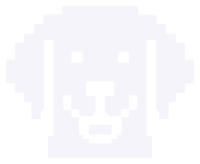
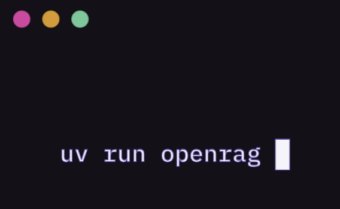
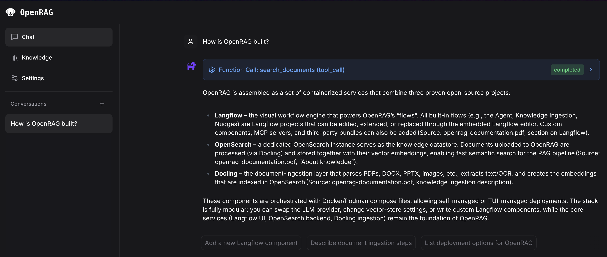
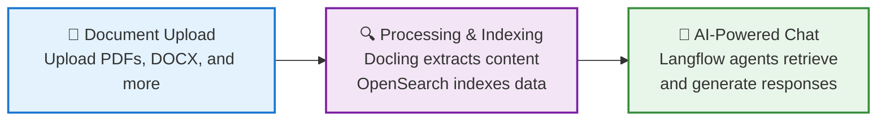

# OpenRAG

<h3>
  <em>Intelligent Agent-powered document search</em>
</h3>

<!-- Badges -->

  

  

  

OpenRAG is a comprehensive Retrieval-Augmented Generation platform that enables intelligent document search and AI-powered conversations. 

Users can upload, process, and query documents through a chat interface backed by large language models and semantic search capabilities. The system utilizes Langflow for document ingestion, retrieval workflows, and intelligent nudges, providing a seamless RAG experience. 

Built with [Starlette](https://github.com/Kludex/starlette) and [Next.js](https://github.com/vercel/next.js). 
Powered by [OpenSearch](https://github.com/opensearch-project/OpenSearch), [Langflow](https://github.com/langflow-ai/langflow), and [Docling](https://github.com/docling-project/docling).

---

## ✨ Highlight Features

- **Pre-packaged & ready to run** - All core tools are hooked up and ready to go, just install and run
- **Agentic RAG workflows** - Advanced orchestration with re-ranking and multi-agent coordination
- **Document ingestion** - Handles messy, real-world data with intelligent parsing
- **Drag-and-drop workflow builder** - Visual interface powered by Langflow for rapid iteration
- **Modular enterprise add-ons** - Extend functionality when you need it
- **Enterprise search at any scale** - Powered by OpenSearch for production-grade performance

## ✨ Quick Start Workflow

**1. Launch OpenRAG**

↓

**2. Add Knowledge**

↓

**3. Start Chatting**

## 🚀 Install OpenRAG

To get started with OpenRAG, see the installation guides in the OpenRAG documentation:

* [Quickstart](https://docs.openr.ag/quickstart)
* [Install the OpenRAG Python package](https://docs.openr.ag/install-options)
* [Deploy self-managed services with Docker or Podman](https://docs.openr.ag/docker)

## 🔄 How OpenRAG Works

OpenRAG follows a streamlined workflow to transform your documents into intelligent, searchable knowledge:

```mermaid
graph LR
    A[📄 Document Upload<br/>Upload PDFs, DOCX, and more] --> B[🔍 Processing & Indexing<br/>Docling extracts content<br/>OpenSearch indexes data]
    B --> C[💬 AI-Powered Chat<br/>Langflow agents retrieve<br/>and generate responses]
    
    style A fill:#e3f2fd,stroke:#1976d2,stroke-width:2px
    style B fill:#f3e5f5,stroke:#7b1fa2,stroke-width:2px
    style C fill:#e8f5e9,stroke:#388e3c,stroke-width:2px
```

 

## 💬 Chat Interface

Experience intelligent conversations powered by your documents.

  

 

## 📚 Document Management

Upload, process, and manage your knowledge base with ease.

  

 

## 🔍 Semantic Search

Powerful search capabilities to find exactly what you need.

  

 

## 🛠️ Development

For developers who want to [contribute to OpenRAG](https://docs.openr.ag/support/contribute) or set up a development environment, see [CONTRIBUTING.md](CONTRIBUTING.md).

## 🆘 Troubleshooting

For assistance with OpenRAG, see [Troubleshoot OpenRAG](https://docs.openr.ag/support/troubleshoot) and visit the [Discussions page](https://github.com/langflow-ai/openrag/discussions).

To report a bug or submit a feature request, visit the [Issues page](https://github.com/langflow-ai/openrag/issues).