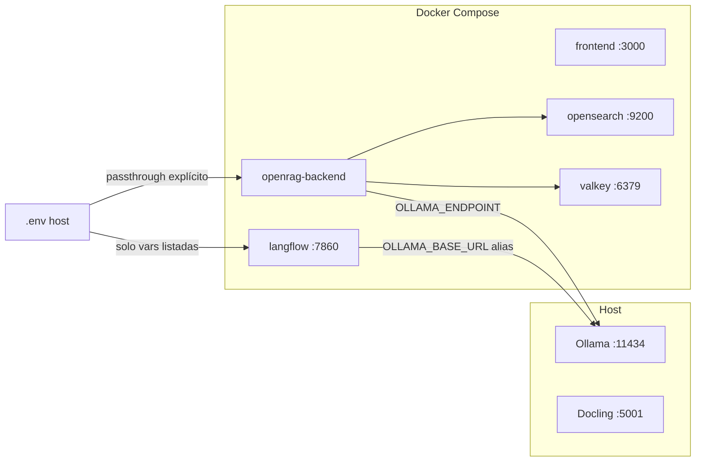

# Production-Readiness Audit — Axioma 2.0

> Auditoría adversarial de production-readiness (config drift, fork drift, seguridad).
> Fecha: 2026-05-31 · Repo: fork de `langflow-ai/openrag` (package `openrag` v0.3.2).
> Relacionado: [PLAN-DEPLOY.md](./PLAN-DEPLOY.md) · [ESTRATEGIA-AXIOMA.md](./ESTRATEGIA-AXIOMA.md) · [00-PRINCIPIOS.md](./mejoras/00-PRINCIPIOS.md) · [DEVOPS-SEGURIDAD.md](./mejoras/DEVOPS-SEGURIDAD.md)

**Método:** lectura directa de `docker-compose.yml`, `.env.example`, `src/config/`, `securityconfig/`, `keys/`, `scripts/setup-droplet.sh`, `docs/PLAN-DEPLOY.md`. `git ls-files keys/` ejecutado en el host.

**Estado reciente:** el drift de `GRANITE_MODEL` inexistente ya fue corregido a `granite4.1:3b` (commit `9bf2a319`). El resto de hallazgos siguen vigentes.

### Ver también

- [`ESTRATEGIA-AXIOMA.md`](./ESTRATEGIA-AXIOMA.md) — índice operativo y prioridad actual.
- [`PLAN-DEPLOY.md`](./PLAN-DEPLOY.md) — pasos operativos local/VPS.
- [`mejoras/00-PRINCIPIOS.md`](./mejoras/00-PRINCIPIOS.md) — reglas transversales para ejecutar cambios.
- Plan maestro (`.cursor/plans`): `axioma_integral_completo_45ce1c44.plan.md`.

### Revisión humana (2026-05-31)

Validación cruzada en la misma conversación: al clonar el repo se confirmó con lectura directa buena parte del informe — certs en `keys/`, puertos publicados, healthcheck con `#` sin comillas, SQLite de Langflow, `SELECTED_EMBEDDING_MODEL=text-embedding-3-small`, `SERVICE_NAME=openrag`, README aún OpenRAG. El informe lee código real; la sección **A VERIFICAR** está correctamente separada de hallazgos confirmados.

**Ajustes de severidad tras revisión:**

| Hallazgo | Severidad original | Severidad revisada | Motivo |
|----------|-------------------|-------------------|--------|
| #16 embedding Langflow | Alto | **Crítico / P0** | Fallo silencioso del corazón RAG (dimensiones inconsistentes, sin error) |
| #1 certs en git | Crítico | **Alto** | #7 desinfla impacto: OS usa certs embebidos, no `./keys`; kirk es PKI demo pública — higiene + riesgo latente, no fuga activa |
| #29 pinning imágenes | — | **Alto** | Agregado: casi todo `:latest`, deploys no reproducibles |

### Verificaciones previas a remediación

Hacer **antes** de tocar código en producción:

1. **#8 rate-limit tiers** — Re-leer `initialize_services()` en `src/main.py`. **Re-confirmado (2026-05-31):** el `return` en líneas 1547–1561 no incluye `"clients"`; el middleware en `rate_limit_middleware.py:43-47` busca `services.get("clients")` → `opensearch_client` siempre `None` → tier `"free"`. Bug funcional confirmado; no solo config drift.

2. **#3 passthrough compose** — Reconciliar con “el chat anda”:
   - **Urgente:** vars que el backend lee directo y no llegan al contenedor: `OPENRAG_ENFORCE_PREREQUISITES`, `OPENRAG_TENANT_ID`, `LANGFUSE_*` (Guardian), `IBM_AUTH_ENABLED`, `EMBEDDING_*` / `LLM_*` en seed de `config_manager`.
   - **Cosmético para chat RAG:** `LLM_MODEL` / `LLM_PROVIDER` no rompen el chat porque el path efectivo es **onboarding → `./config` → flows Langflow** (Langflow sí recibe `OLLAMA_BASE_URL` y el modelo vive en el flow).
   - Priorizar en #3 solo la parte urgente; no confundir con fallo de chat.

---

## Checklist de remediación

| ID | Prioridad | Tarea | Hallazgos | Estado |
|----|-----------|-------|-----------|--------|
| p0-embedding-drift | **P0** | Alinear `SELECTED_EMBEDDING_MODEL` con `nomic-embed-text`; propagar `EMBEDDING_MODEL` al backend | #16 | pendiente |
| p0-rate-limit | **P0** | Fix `rate_limit_middleware`: usar `config.settings.clients.opensearch` | #8 | pendiente |
| p0-secrets-ports | P0 | Cerrar puertos 9200/6379/7860/5601 en perfil prod; Valkey `requirepass` | #2, #6 | pendiente |
| p0-compose-env-urgent | P0 | Passthrough backend **urgente**: `OPENRAG_ENFORCE`, `OPENRAG_TENANT_ID`, `LANGFUSE_*`, `IBM_AUTH`, `EMBEDDING_*` (no solo `LLM_*`) o `env_file: .env` | #3, #4, #25 | pendiente |
| p0-healthcheck | P0 | Fix healthcheck password quoting (`#` en password) | #5 | pendiente |
| p1-certs-hygiene | P1 | `git rm --cached keys/*.pem`; aclarar PKI OS vs `./keys` en docs | #1, #7 | pendiente |
| p1-image-pinning | P1 | Fijar `OPENRAG_VERSION` y tags Valkey/dashboards; documentar en deploy | #29 | pendiente |
| p1-fork-axioma | P1 | `INGEST_SAMPLE_DATA=false`, system prompt Axioma, rebrand UI mínimo | #9, #17 | pendiente |
| p1-prod-data | P1 | Langflow Postgres, `verify_certs`, alinear `setup-droplet.sh` con PLAN-DEPLOY | #10–#12 | pendiente |
| p2-multitenant | P2 | Diseño multi-tenant (`tenants.yml`, índices por cliente, `OPENRAG_TENANT_ID`) | #15 | pendiente |

---

## Crítico

### 2. Puertos internos publicados por defecto en Compose

- **Categoría:** production-readiness / seguridad
- **Evidencia:**
  - `docker-compose.yml:14-16` — `9200:9200`, `9600:9600`
  - `docker-compose.yml:37-38` — `5601:5601`
  - `docker-compose.yml:154-155` — `7860:7860`
  - `docker-compose.yml:217-218` — `6379:6379`
  - `docs/PLAN-DEPLOY.md` advierte no abrirlos en ufw, pero Compose los expone igual
- **Por qué importa:** VPS con IP pública + `docker compose up` = OpenSearch, Valkey y Langflow accesibles sin proxy ni auth adicional.
- **Fix sugerido:** Perfil `prod`: quitar `ports` o bind `127.0.0.1:`; solo publicar `3000` (detrás de Caddy). Valkey solo red interna.
- **Esfuerzo:** M

### 3. Passthrough Compose: vars del `.env` no llegan al backend

- **Categoría:** config drift
- **Evidencia:** `docker-compose.yml:51-123` lista vars explícitas; **no** incluye `LLM_PROVIDER`, `LLM_MODEL`, `EMBEDDING_*`, `IBM_AUTH_ENABLED`, `LANGFUSE_*`, `OPENRAG_ENFORCE_PREREQUISITES`, `OPENRAG_TENANT_ID`, `DEFAULT_DOCS_URL`, `FETCH_OPENRAG_DOCS_AT_STARTUP`
  - Leídas en código: `src/config/config_manager.py:277-302`, `src/config/settings.py:79-102`, `src/utils/encryption.py:30`
  - `LANGFUSE_*` solo en contenedor `langflow` (`docker-compose.yml:163-165`), pero `guardrail_service` las necesita en backend
- **Por qué importa:** Regenerar `.env` desde example y activar Guardian/Langfuse/IBM auth/encryption enforce **no tiene efecto** dentro del contenedor backend. Fallo silencioso.
- **Matiz (no contradice “el chat anda”):** el chat RAG va por Langflow (`OLLAMA_BASE_URL` en contenedor langflow, modelo en el flow tras onboarding). Que `LLM_MODEL` no llegue al backend **no rompe el chat** — pero sí rompe seed de `config_manager`, Guardian, cifrado y paths que el backend lee directo.
- **Urgencia:** alta para `OPENRAG_ENFORCE_*`, `LANGFUSE_*`, `EMBEDDING_*`, `IBM_AUTH_*`; baja para `LLM_MODEL` si onboarding ya completó.
- **Fix sugerido:** Añadir vars **urgentes** al bloque `openrag-backend` **o** `env_file: .env` + lista mínima de overrides.
- **Esfuerzo:** M

### 4. Cifrado de credenciales desactivado por defecto

- **Categoría:** seguridad
- **Evidencia:**
  - `.env.example:64` — `OPENRAG_ENFORCE_PREREQUISITES=false`
  - `src/utils/encryption.py:29-36` — sin `OPENRAG_ENCRYPTION_KEY` → `return None`
  - `src/utils/encryption.py:65-67` — sin master secret → **devuelve plaintext**
- **Por qué importa:** `./config` (API keys de conectores, credenciales LLM) en disco sin cifrar en VPS; `OPENRAG_ENFORCE_PREREQUISITES` no llega al contenedor (hallazgo #3).
- **Fix sugerido:** VPS: `OPENRAG_ENFORCE_PREREQUISITES=true` + clave fuerte; propagar en compose; fallar arranque si falta clave.
- **Esfuerzo:** S

### 5. Healthcheck OpenSearch vulnerable a `#` en password

- **Categoría:** production-readiness
- **Evidencia:**
  - `docker-compose.yml:21` — `curl -ku admin:$$OPENSEARCH_PASSWORD` sin comillas alrededor de `user:pass`
  - `Dockerfile:110` — mismo patrón en `setup-security.sh`
  - `src/tui/managers/env_manager.py:142` — TUI genera passwords con `!@#$%^&*`
- **Por qué importa:** Password con `#` truncada por shell → healthcheck perpetuo `unhealthy`, `depends_on` bloqueado, falso negativo en ops.
- **Fix sugerido:** `curl -ku "admin:${OPENSEARCH_PASSWORD}"` en healthcheck y setup script.
- **Esfuerzo:** S

### 6. Valkey sin autenticación y expuesto

- **Categoría:** seguridad
- **Evidencia:**
  - `docker-compose.yml:211-218` — `valkey-server` sin `requirepass`, puerto `6379:6379`
  - `src/config/settings.py:64` — default `redis://localhost:6379/0` (fuera de compose sin `.env` → localhost)
- **Por qué importa:** Cache semántica + contadores rate-limit manipulables; flush/lectura cross-tenant si el puerto es reachable.
- **Fix sugerido:** `--requirepass`, URL con password, sin bind público; red Docker only.
- **Esfuerzo:** M

### 7. `generate-certs.sh` no alimenta el contenedor OpenSearch

- **Categoría:** config drift / docs
- **Evidencia:**
  - `generate-certs.sh:7-17` — genera `keys/kirk*.pem` en host
  - `Dockerfile:120-122` — securityadmin usa `/usr/share/opensearch/config/kirk.pem` **dentro de la imagen**
  - `docker-compose.yml:17-18` — OpenSearch **no** monta `./keys`
  - `docs/PLAN-DEPLOY.md` y `scripts/setup-droplet.sh:63-68` asumen regenerar certs en host
- **Por qué importa:** Operador cree que rotó PKI de prod; OpenSearch sigue con certs de build. Falsa sensación de seguridad.
- **Fix sugerido:** Aclarar en docs que PKI OS es de imagen; si custom PKI → montar volumen + rebuild; quitar paso engañoso de `setup-droplet.sh` o cablearlo de verdad.
- **Esfuerzo:** M

### 8. Rate-limit tiers siempre `free` (bug de wiring)

- **Categoría:** production-readiness (bug funcional confirmado)
- **Evidencia:**
  - `src/rate_limit_middleware.py:43-47` — busca `services.get("clients")`
  - `src/main.py:1547-1561` — `initialize_services()` **no** incluye `"clients"` en el dict retornado (re-leído 2026-05-31)
  - `src/services/rate_limiter.py:92-94` — sin OpenSearch client → tier `"free"`
- **Por qué importa:** Tiers `pro`/`enterprise` documentados en `.env.example` nunca aplican; modelo de monetización B2B roto. Es el único hallazgo de **bug de código** (no solo config drift).
- **Fix sugerido:** Pasar `clients.opensearch` desde módulo global `config.settings.clients` o añadir `clients` al dict de services.
- **Esfuerzo:** S
- **Prioridad remediación:** P0 (junto con #16)

### 9. Onboarding ingesta docs OpenRAG upstream por defecto

- **Categoría:** fork drift / production-readiness
- **Evidencia:**
  - `.env.example:8` — `INGEST_SAMPLE_DATA=true`
  - `docker-compose.yml:62` — `INGEST_SAMPLE_DATA=${INGEST_SAMPLE_DATA:-true}`
  - `.env.example:16` — `DEFAULT_DOCS_URL=https://www.openr.ag/`
  - `src/config/settings.py:121` — fallback distinto: `"https://docs.openr.ag/"`
  - `frontend/lib/constants.ts:7` — system prompt: `"You are the OpenRAG Agent..."`
- **Por qué importa:** KB de clientes contables contaminada con docs upstream; agente responde "qué es OpenRAG", no Axioma.
- **Fix sugerido:** `INGEST_SAMPLE_DATA=false` en example/compose default Axioma; `DEFAULT_DOCS_URL` vacío o docs Axioma; actualizar system prompt.
- **Esfuerzo:** M

### 16. Drift embedding: Langflow default OpenAI, Axioma default Ollama — **P0**

- **Categoría:** config drift → **fallo silencioso RAG** (elevado a Crítico tras revisión humana)
- **Evidencia:**
  - `.env.example:137-140` — `EMBEDDING_MODEL=nomic-embed-text` (768d Ollama)
  - `docker-compose.yml:196` — `SELECTED_EMBEDDING_MODEL=${SELECTED_EMBEDDING_MODEL:-text-embedding-3-small}` (OpenAI, dimensión distinta)
  - Onboarding persiste `embedding_model` en `./config`, pero flows Langflow reciben `SELECTED_EMBEDDING_MODEL` del entorno del contenedor langflow
- **Por qué importa:** Si Langflow ingesta/embebe con `text-embedding-3-small` mientras onboarding configuró `nomic-embed-text`, el índice mezcla dimensiones vectoriales → búsqueda RAG devuelve basura **sin error visible**. Para una plataforma cuyo corazón es el RAG, es peor que un puerto expuesto mal configurado.
- **Fix sugerido:** Default `nomic-embed-text` (o `${EMBEDDING_MODEL}`) en compose Langflow; propagar `EMBEDDING_MODEL` al backend; re-ingerir si ya hay docs con dimensión incorrecta.
- **Esfuerzo:** S
- **Prioridad remediación:** P0 (antes de demo con cliente)

---

## Alto

### 1. Certs demo OpenSearch versionados en git (severidad revisada: bajó de Crítico)

- **Categoría:** seguridad / higiene repo
- **Evidencia:**
  - `.gitignore:14` — `*.pem` ignorado (no aplica a archivos ya trackeados)
  - `git ls-files keys/` — **trackeados:** `keys/kirk-key.pem`, `keys/kirk.pem`, `keys/root-ca.pem`, `keys/root-ca.srl` (commit `dbb68093`)
- **Por qué importa (matizado):** Los kirk son PKI **demo pública** de OpenSearch; el “secreto” nunca fue secreto. Además, hallazgo **#7**: el contenedor OpenSearch usa certs **embebidos en imagen** (`Dockerfile:120-122`), no monta `./keys` — los PEM commiteados **no están hoy en el path de confianza** del OS que corre. Riesgo = higiene repo + operador que reutilice esos archivos en otro wiring futuro, no fuga activa del stack actual.
- **Fix sugerido:** `git rm --cached keys/*.pem keys/*.srl`; PKI por entorno si algún día se monta custom; documentar relación imagen vs `./keys`.
- **Esfuerzo:** S

### 10. Langflow en SQLite por defecto (no apto prod)

- **Categoría:** production-readiness
- **Evidencia:** `docker-compose.yml:174` — `LANGFLOW_DATABASE_URL=${LANGFLOW_DATABASE_URL:-sqlite:////app/langflow-data/langflow.db}`
- **Por qué importa:** Single-writer, corrupción en apagados, sin HA; multi-tenant enterprise necesita Postgres.
- **Fix sugerido:** VPS: `postgresql://...`; backup/restore documentado.
- **Esfuerzo:** M

### 11. `verify_certs=False` en cliente OpenSearch

- **Categoría:** seguridad
- **Evidencia:** `src/config/settings.py:386-387` — `use_ssl=True, verify_certs=False`
- **Por qué importa:** MITM en red no confiable (VPS multi-servicio, VLAN compartida).
- **Fix sugerido:** CA confiable + `verify_certs=True` o fingerprint pinning.
- **Esfuerzo:** M

### 12. `setup-droplet.sh` desalineado con el repo real

- **Categoría:** config drift / docs
- **Evidencia:**
  - `scripts/setup-droplet.sh:79-80` — pide `ENCRYPTION_KEY`, `NEXTAUTH_SECRET` (no existen en `.env.example`)
  - `scripts/setup-droplet.sh:96-99` — anuncia IP pública en 3000, **8000**, 7860, 5601 (backend no expone 8000 en compose)
  - Sin ufw/Caddy/TLS (a diferencia de `PLAN-DEPLOY.md`)
- **Por qué importa:** Script de "prod" guía a nombres de vars incorrectos y superficie de ataque amplia.
- **Fix sugerido:** Alinear con `PLAN-DEPLOY.md`: `OPENRAG_ENCRYPTION_KEY`, ufw, Caddy, solo :3000 público.
- **Esfuerzo:** M

### 13. `SESSION_SECRET` con default hardcodeado

- **Categoría:** seguridad
- **Evidencia:** `src/config/settings.py:59` — `os.getenv("SESSION_SECRET", "your-secret-key-change-in-production")`
- **Por qué importa:** Si `SESSION_SECRET` vacío en `.env` (example línea 282), cae al default conocido. Hoy JWT usa RSA (`session_manager.py`), pero el default es footgun y confunde operadores.
- **Fix sugerido:** Sin default en prod; exigir generación en TUI/setup script.
- **Esfuerzo:** S

### 14. OIDC issuer en HTTP / hostname interno

- **Categoría:** seguridad
- **Evidencia:**
  - `securityconfig/config.yml:15` — `openid_connect_url: "http://openrag-backend:8000/.well-known/openid-configuration"`
  - `src/session_manager.py:188-191` — issuer `http://openrag-backend:8000` o `http://{OPENRAG_FQDN}:8000` (sin HTTPS)
- **Por qué importa:** Tokens con issuer HTTP; `OPENRAG_FQDN` no está en compose ni `.env.example` backend.
- **Fix sugerido:** `https://{dominio}` + `OPENRAG_FQDN` propagado; TLS en proxy.
- **Esfuerzo:** M

### 15. Multi-tenancy a medias (single-tenant real)

- **Categoría:** production-readiness
- **Evidencia:**
  - `securityconfig/tenants.yml:5` — `# Empty tenants - using global tenant only`
  - `src/utils/encryption.py:198` — `OPENRAG_TENANT_ID` default `"openrag"` (no propagado a compose backend)
  - `src/utils/acl_utils.py` — DLS por documento (`owner`, `allowed_users`), no por tenant/org
- **Por qué importa:** Trayectoria "multi-cliente enterprise" requiere índices/tenants OpenSearch, aislamiento de `config/`, billing por tier (ya roto en #8).
- **Fix sugerido:** Diseño explícito: tenant por cliente → índice o prefijo + `tenants.yml` + `OPENRAG_TENANT_ID` por deploy.
- **Esfuerzo:** L

### 17. Frontend y producto siguen siendo OpenRAG

- **Categoría:** fork drift
- **Evidencia:**
  - `frontend/app/layout.tsx` — `title: "OpenRAG"`
  - `frontend/components/header.tsx` — texto `"OpenRAG"`
  - `README.md:5` — `# OpenRAG`
  - Contraste: `src/main.py:1585` — Swagger `"Axioma API"`
- **Por qué importa:** Usuarios B2B LATAM ven producto upstream; confianza y soporte incorrectos.
- **Fix sugerido:** Rebrand UI mínimo (título, logo, login, system prompt); README Axioma-first.
- **Esfuerzo:** M

### 29. Imágenes Docker sin pin de versión (`:latest`)

- **Categoría:** production-readiness (agregado en revisión humana)
- **Evidencia:**
  - `docker-compose.yml:3` — `langflowai/openrag-opensearch:${OPENRAG_VERSION:-latest}`
  - `docker-compose.yml:41,136,149` — backend, frontend, langflow → `${OPENRAG_VERSION:-latest}`
  - `docker-compose.yml:209` — `valkey/valkey-bundle:latest` (hardcodeado)
  - Excepción parcial: `opensearch-dashboards:3.0.0` (`docker-compose.yml:29`)
- **Por qué importa:** Deploys no reproducibles; `docker compose pull` puede traer breaking changes sin aviso; imposible rollback determinista en VPS.
- **Fix sugerido:** Fijar `OPENRAG_VERSION` en `.env.example` / CI al tag probado; pin Valkey a digest o tag semver; documentar en `PLAN-DEPLOY.md`.
- **Esfuerzo:** S

---

## Medio

### 18. Alias Ollama: `OLLAMA_ENDPOINT` vs `OLLAMA_BASE_URL`

- **Categoría:** config drift
- **Evidencia:**
  - Backend: `docker-compose.yml:74` — `OLLAMA_ENDPOINT`
  - Langflow: `docker-compose.yml:172` — `OLLAMA_BASE_URL=${OLLAMA_ENDPOINT}`
  - Sync runtime: `src/config/settings.py:536-537` — solo tras cargar config
- **Por qué importa:** Operador que setea solo `OLLAMA_BASE_URL` (nombre Langflow) rompe backend/`config_manager`.
- **Fix sugerido:** Documentar canónico `OLLAMA_ENDPOINT`; alias en `config_manager` o compose para ambos.
- **Esfuerzo:** S

### 19. Alias WatsonX triple (`ENDPOINT` / `URL` / `API_BASE`)

- **Categoría:** config drift
- **Evidencia:** compose backend `WATSONX_ENDPOINT`; Langflow `WATSONX_URL`; LiteLLM `WATSONX_API_BASE` en `src/config/settings.py:528`
- **Por qué importa:** Irrelevante si solo Ollama, pero footgun si se activa WatsonX.
- **Fix sugerido:** Una var canónica + mapeo en compose (como ya hace Langflow para URL).
- **Esfuerzo:** S

### 20. `HOST_DOCKER_INTERNAL` documentada, no implementada

- **Categoría:** config drift / docs
- **Evidencia:** `.env.example:157` comentada; **0** `os.getenv("HOST_DOCKER_INTERNAL")` en `src/`
- **Por qué importa:** Operador en Podman/rootless cree que puede override host gateway; no funciona.
- **Fix sugerido:** Implementar en `container_utils.py` o quitar de docs.
- **Esfuerzo:** S

### 21. IBM Watsonx/COS en UI aunque defaults off

- **Categoría:** fork drift
- **Evidencia:**
  - `.env.example:96-99` — `IBM_AUTH_ENABLED=false`
  - `frontend/app/onboarding/_components/onboarding-card.tsx` — tab Watsonx siempre visible
  - `src/connectors/connection_manager.py:450` — IBM COS `available` solo si `IBM_AUTH_ENABLED`
- **Por qué importa:** Ruido en onboarding Axioma/Ollama; confusión operativa.
- **Fix sugerido:** Ocultar Watsonx/IBM en UI cuando `LLM_PROVIDER=ollama` o flag `AXIOMA_STACK=ollama`.
- **Esfuerzo:** M

### 22. Langflow default credentials si auto-login

- **Categoría:** seguridad
- **Evidencia:** `src/config/settings.py:280-283` — fallback `langflow`/`langflow`
- **Por qué importa:** Si `LANGFLOW_AUTO_LOGIN=true` sin superuser configurado → credenciales conocidas en :7860.
- **Fix sugerido:** Example ya tiene `LANGFLOW_AUTO_LOGIN=False`; en prod exigir superuser+password fuertes; no publicar 7860.
- **Esfuerzo:** S

### 23. CORS `*` en SSE de chat

- **Categoría:** seguridad
- **Evidencia:** `src/api/chat.py:58` — `"Access-Control-Allow-Origin": "*"`
- **Por qué importa:** Bajo riesgo si solo se usa proxy Next.js; alto si backend :8000 se expone directo.
- **Fix sugerido:** Orígenes explícitos o eliminar header (same-origin vía proxy).
- **Esfuerzo:** S

### 24. `OPENSEARCH_HOST` default `localhost` en código

- **Categoría:** config drift
- **Evidencia:** `src/config/settings.py:28` — default `"localhost"`; compose usa `opensearch`
- **Por qué importa:** Backend fuera de Docker sin `.env` → fallo de conexión no obvio.
- **Fix sugerido:** Alinear default o documentar "solo con compose".
- **Esfuerzo:** S

### 25. Guardian + Langfuse: mitad cableada

- **Categoría:** config drift
- **Evidencia:** `GUARDIAN_ENABLED` → backend compose sí; `LANGFUSE_*` → solo Langflow (#3)
- **Por qué importa:** Fase 4 activada sin scores en Langfuse.
- **Fix sugerido:** Pasar `LANGFUSE_*` al backend cuando Guardian activo.
- **Esfuerzo:** S

---

## Bajo

### 26. `LANGFLOW_VERSION` inyectada, no leída

- **Categoría:** config drift
- **Evidencia:** `docker-compose.yml:94`; 0 matches en `src/`
- **Fix:** Quitar o usar en telemetría.
- **Esfuerzo:** S

### 27. IBM COS / AWS vars en compose, ausentes en `.env.example`

- **Categoría:** config drift / fork drift
- **Evidencia:** `docker-compose.yml:80-89` — `IBM_COS_*`, `AWS_S3_ENDPOINT`
- **Fix:** Documentar como opt-in IBM o eliminar del compose Axioma.
- **Esfuerzo:** S

### 28. `SERVICE_NAME=openrag` en example

- **Categoría:** fork drift
- **Evidencia:** `.env.example:280`
- **Fix:** `axioma` para logs/observabilidad.
- **Esfuerzo:** S

---

## Nitpick

- **`IBM_AUTH_ENABLED` duplicado** en `src/config/settings.py:79` y `:104`
- **`LANGFLOW_DEACTIVATE_TRACING`** en compose sin valor (`docker-compose.yml:166`) — passthrough frágil
- **Flow IDs hardcodeados** en `.env.example:43-48` — pueden no coincidir con fork
- **Docs Docusaurus** (`docs/docusaurus.config.js`) — sitio `docs.openr.ag` upstream intacto
- **Helm defaults** Anthropic/OpenAI (`kubernetes/helm/openrag/values.yaml`) — no reflejan stack Ollama Axioma

---

## A VERIFICAR (no confirmado en código)

1. Comportamiento real del healthcheck con password `#` en tu `.env` actual (reproducir con `docker compose`).
2. Si la imagen `langflowai/openrag-opensearch` embebe siempre la misma PKI kirk o varía por tag/build.
3. Número de workers Uvicorn en imagen backend (impacto fallback in-memory de rate limit).
4. Si `SESSION_SECRET` se usa en algún path de cookies fuera de `session_manager` (búsqueda no encontró uso activo de firma).

---

## Roadmap de remediación sugerido (orden revisado)

1. **P0 RAG + billing (S):** #16 embedding Langflow ↔ `nomic-embed-text`; #8 fix rate-limit tiers
2. **P0 seguridad expuesta (S-M):** cerrar puertos, Valkey auth, healthcheck `#`, `OPENRAG_ENFORCE` + vars urgentes de #3
3. **P1 higiene + reproducibilidad (S-M):** #1 `git rm --cached` PEMs; #29 pin imágenes; #7 aclarar docs PKI
4. **P1 fork Axioma (M):** `INGEST_SAMPLE_DATA=false`, system prompt, UI title
5. **P1 prod data (M):** Langflow Postgres, `verify_certs`, Caddy+ufw en setup-droplet
6. **P2 enterprise (L):** multi-tenant OpenSearch + tiers billing

**Última actualización del plan:** 2026-05-31 — incorpora revisión humana (severidad #1/#16, hallazgo #29, verificación #8, matiz #3).
