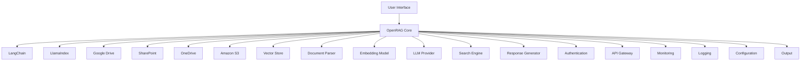

OpenRAG is an open-source package for building agentic RAG systems that integrates with a wide range of orchestration tools, vector databases, and LLM providers.

OpenRAG connects and amplifies three popular, proven open-source projects into one powerful platform:

* [Langflow](https://docs.langflow.org): Langflow is a popular tool for building and deploying AI agents and MCP servers. It supports all major LLMs, vector databases, and a growing library of AI tools. 

* [OpenSearch](https://docs.opensearch.org/latest/): OpenSearch is a community-driven, Apache 2.0-licensed open source search and analytics suite that makes it easy to ingest, search, visualize, and analyze data.

* [Docling](https://docling-project.github.io/docling/): Docling simplifies document processing, parsing diverse formats — including advanced PDF understanding — and providing seamless integrations with the gen AI ecosystem. 

OpenRAG builds on Langflow's familiar interface while adding OpenSearch for vector storage and Docling for simplified document parsing, with opinionated flows that serve as ready-to-use recipes for ingestion, retrieval, and generation from popular sources like Google Drive, OneDrive, and Sharepoint.

What's more, every part of the stack is swappable. Write your own custom components in Python, try different language models, and customize your flows to build an agentic RAG system.

Ready to get started? [Install OpenRAG](/install) and then run the [Quickstart](/quickstart) to create a powerful RAG pipeline.

## System Architecture

Text.

